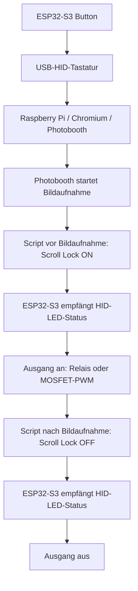

# Photobooth ESP32-S3 HID Button Box

> Externe Button- und Relaissteuerung für Photobooth: Ein ESP32-S3 meldet sich als USB-HID-Tastatur an und nutzt Scroll Lock als Rückkanal für ein Relais oder eine Statuslampe.


## Überblick

Dieses Projekt ersetzt eine direkte GPIO-Button-/Relais-Anbindung von Photobooth durch einen externen ESP32-S3. Der Mikrocontroller wird per USB am Raspberry Pi angeschlossen und verhält sich wie eine normale Tastatur.

- **Buttons:** Senden Tastendrücke an Photobooth, z. B. `t` für Bildaufnahme.
- **Rückkanal:** Der Raspberry Pi setzt den Scroll-Lock-LED-Status der HID-Tastatur.
- **Ausgang:** Der ESP32-S3 liest den Scroll-Lock-Status und schaltet damit wahlweise ein Relais oder einen PWM-gesteuerten MOSFET.
- **Duty Cycle:** Im MOSFET-Modus wird der PWM-Duty-Cycle wahlweise über ein Potentiometer oder über einen gespeicherten Festwert vorgegeben.
- **Vorteil:** Kein Photobooth-GPIO-Support und kein Remote-Buzzer-Server notwendig.

## Funktionsprinzip



Als Textvariante:

```text
Button drücken -> ESP32-S3 sendet Taste -> Photobooth reagiert
Photobooth vor Aufnahme -> Scroll Lock ON  -> ESP32-S3 schaltet Ausgang ein
Photobooth nach Aufnahme -> Scroll Lock OFF -> ESP32-S3 schaltet Ausgang aus
```

## Hardware

Verwendet wird ein ESP32-S3 DevKit mit nativer USB-Schnittstelle. Geeignete Boards sind zum Beispiel:

- ESP32-S3 DevKitC
- ESP32-S3-WROOM Dev Board
- ESP32-S3 N16R8 Dev Board

> [!IMPORTANT]
> Der ESP32-S3 muss über die native USB-Buchse als HID-Gerät betrieben werden können. Viele Boards besitzen zusätzlich eine separate USB-UART-Buchse zum Flashen.

## Pinbelegung

Buttons werden jeweils zwischen GPIO und GND angeschlossen. Im Sketch sind interne Pullups aktiviert.

| Funktion | GPIO | Taste | Browser-Keycode |
| --- | ---: | :---: | ---: |
| Bildaufnahme | 4 | `t` | 84 |
| Collage | 5 | `c` | 67 |
| Drucken | 6 | `p` | 80 |
| Video | 7 | `v` | 86 |
| Custom / frei | 15 | `x` | 88 |
| Relais oder MOSFET-Gate | 16 | Scroll Lock | - |
| Poti-Schleifer | 1 | PWM Duty-Cycle | - |

Button-Verdrahtung:

```text
GPIO ---- Button ---- GND
```

Ausgangs-Konfiguration im Sketch:

```cpp
const OutputMode OUTPUT_MODE = OUTPUT_MODE_RELAY;
```

Für ein klassisches Relais bleibt `OUTPUT_MODE_RELAY` aktiv. Für einen MOSFET wird auf `OUTPUT_MODE_MOSFET` umgestellt.

Relais-Polarität im Sketch:

```cpp
const bool RELAY_ACTIVE_LOW = true;
```

Bei einem Active-High-Relaismodul muss der Wert auf `false` geändert werden. Die Relais-Polarität wird nur im Relais-Modus verwendet.

MOSFET-/Poti-Konfiguration im Sketch:

```cpp
const uint8_t POTI_PIN = 1;
const uint32_t MOSFET_PWM_FREQUENCY_HZ = 1000;
const uint8_t MOSFET_PWM_RESOLUTION_BITS = 8;
const bool MOSFET_USE_POTI_DUTY_CYCLE = false;
const uint16_t MOSFET_DEFAULT_FIXED_DUTY = 128;
```

Im MOSFET-Modus liegt bei Scroll Lock OFF ein PWM-Duty-Cycle von 0 % an. Bei Scroll Lock ON wird der Duty-Cycle entweder laufend aus dem Poti-Wert gelesen oder aus einem gespeicherten Festwert gesetzt. Das MOSFET-Gate wird aktiv HIGH angesteuert.

- `MOSFET_USE_POTI_DUTY_CYCLE = true`: Poti ist aktiv und bestimmt den Duty-Cycle.
- `MOSFET_USE_POTI_DUTY_CYCLE = false`: Poti ist deaktiviert; der ESP32 nutzt den gespeicherten Festwert.
- `MOSFET_DEFAULT_FIXED_DUTY` ist der fest programmierte Startwert, solange noch kein Wert gespeichert wurde. Bei 8 Bit PWM ist der gültige Bereich `0` bis `255`.

Poti-Verdrahtung:

```text
3V3 ---- Poti ---- GND
          |
          +---- GPIO 1
```


## MOSFET-Duty-Cycle per serieller Schnittstelle setzen

Wenn `MOSFET_USE_POTI_DUTY_CYCLE` auf `false` steht, nutzt der ESP32-S3 den gespeicherten Festwert für den MOSFET-Duty-Cycle. Der Wert wird im nichtflüchtigen Speicher des ESP32 abgelegt und bleibt nach einem Neustart erhalten.

Serielle Schnittstelle:

```text
115200 Baud
Zeilenende: NL oder CR/NL
```

Einfache Befehle:

| Befehl | Funktion |
| --- | --- |
| `duty?` | gespeicherten Festwert anzeigen |
| `duty 128` | Festwert direkt als PWM-Wert speichern, bei 8 Bit gültig `0` bis `255` |
| `duty 50%` | Festwert als Prozentwert speichern, gültig `0%` bis `100%` |

Beispiele:

```text
duty?
duty 180
duty 70%
```

Nach einem gültigen `duty`-Befehl antwortet der ESP32 mit `OK: duty saved` und speichert den neuen Wert dauerhaft. Wenn der MOSFET-Ausgang gerade eingeschaltet ist, wird der neue Duty-Cycle sofort angewendet.

## Sicherheit bei Netzspannung

> [!WARNING]
> Arbeiten an 230 V Netzspannung sind gefährlich und dürfen nur von fachkundigen Personen durchgeführt werden.

Wenn mit dem Relais Netzspannung geschaltet wird:

- Nur geeignete Relais- oder SSR-Module verwenden.
- Netzspannung berührungssicher einhausen.
- Zugentlastung verwenden.
- Schutzleiter korrekt führen.
- Kleinspannung und Netzspannung räumlich sauber trennen.
- Keine offenen 230-V-Klemmen im Gehäuse zugänglich lassen.

Die ESP32-Seite ist Kleinspannung. Die Netzspannungsseite muss separat sicher aufgebaut werden.

## Arduino IDE Einstellungen

Empfohlene Einstellungen:

| Einstellung | Wert |
| --- | --- |
| Board | `ESP32S3 Dev Module` |
| USB Mode | `USB-OTG / TinyUSB` |
| USB CDC On Boot | `Enabled` oder `Disabled` |
| Flash Size | passend zum Board, z. B. `16MB` bei N16R8 |
| PSRAM | passend zum Board, z. B. `OPI PSRAM` bei N16R8 |

Zum Flashen wird bei vielen Boards die COM-/USB-UART-Buchse verwendet. Für den späteren Betrieb am Raspberry Pi wird die native USB-Buchse verwendet.

## Photobooth-Tasten konfigurieren

In Photobooth können die normalen Browser-Keycodes verwendet werden:

```text
Bildaufnahme: 84
Collage:      67
Drucken:      80
Video:        86
Custom:       88
```

## Scroll-Lock-Helferscript auf dem Raspberry Pi

Auf dem Raspberry Pi wird ein kleines Script angelegt, das den Scroll-Lock-LED-Status des ESP32-S3-Keyboards setzt.

### 1. Pakete installieren

```bash
sudo apt update
sudo apt install python3-evdev
```

### 2. Gerätepfad finden

```bash
ls -l /dev/input/by-id/
```

Gesucht wird ein Eintrag mit `-event-kbd`, zum Beispiel:

```text
/dev/input/by-id/usb-Espressif_Systems_ESP32S3_DEV_EXAMPLE-event-kbd
```

> [!NOTE]
> Der konkrete Gerätepfad ist boardabhängig. Passe `DEVICE` im Script an deinen eigenen Pfad an.

### 3. Script anlegen

```bash
sudo nano /usr/local/bin/scrolllock-relay
```

Inhalt:

```python
#!/usr/bin/env python3
import sys
from evdev import InputDevice, ecodes

DEVICE = "/dev/input/by-id/usb-Espressif_Systems_ESP32S3_DEV_EXAMPLE-event-kbd"

if len(sys.argv) != 2 or sys.argv[1] not in ("on", "off"):
    print("Usage: scrolllock-relay on|off")
    sys.exit(1)

state = 1 if sys.argv[1] == "on" else 0

dev = InputDevice(DEVICE)
dev.write(ecodes.EV_LED, ecodes.LED_SCROLLL, state)
dev.syn()
```

Script ausführbar machen:

```bash
sudo chmod +x /usr/local/bin/scrolllock-relay
```

### 4. Script testen

```bash
sudo /usr/local/bin/scrolllock-relay on
sleep 2
sudo /usr/local/bin/scrolllock-relay off
```

Das Relais sollte einschalten und danach wieder ausschalten. Im MOSFET-Modus sollte der PWM-Ausgang einschalten; die Stärke wird über das Poti eingestellt.

## Ausführung durch Photobooth erlauben

Photobooth läuft typischerweise als User `www-data`. Damit Photobooth das Script mit den nötigen Rechten ausführen darf, wird eine sudoers-Regel angelegt:

```bash
sudo visudo
```

Am Ende einfügen:

```text
www-data ALL=(root) NOPASSWD: /usr/local/bin/scrolllock-relay
```

Test:

```bash
sudo -u www-data sudo /usr/local/bin/scrolllock-relay on
sleep 2
sudo -u www-data sudo /usr/local/bin/scrolllock-relay off
```

Wenn das Relais klickt oder der MOSFET-Ausgang reagiert, kann Photobooth das Script verwenden.

## Photobooth konfigurieren

Im Photobooth-Adminpanel unter den Befehlen:

| Einstellung | Befehl |
| --- | --- |
| Script / Befehl vor Bildaufnahme | `sudo /usr/local/bin/scrolllock-relay on` |
| Script / Befehl nach Bildaufnahme | `sudo /usr/local/bin/scrolllock-relay off` |

Damit wird der konfigurierte Ausgang direkt vor der eigentlichen Aufnahme eingeschaltet und nach der Aufnahme wieder ausgeschaltet.

## Debugging

Prüfen, ob der ESP32-S3 als Eingabegerät erkannt wird:

```bash
lsusb
ls -l /dev/input/by-id/
```

Prüfen, wohin der `by-id`-Link zeigt:

```bash
readlink -f /dev/input/by-id/usb-Espressif_Systems_ESP32S3_DEV_EXAMPLE-event-kbd
```

Direkter Scroll-Lock-Test:

```bash
sudo python3 - <<'PY'
from evdev import InputDevice, ecodes
import time

DEVICE = "/dev/input/by-id/usb-Espressif_Systems_ESP32S3_DEV_EXAMPLE-event-kbd"

dev = InputDevice(DEVICE)
dev.write(ecodes.EV_LED, ecodes.LED_SCROLLL, 1)
dev.syn()
time.sleep(2)
dev.write(ecodes.EV_LED, ecodes.LED_SCROLLL, 0)
dev.syn()
PY
```

## Repository-Inhalt

```text
.
├── README.md
└── photobooth_esp32s3_hid_scrolllock_relay.ino
```

## Hinweise

- Der ESP32-S3 übernimmt die Hardwareseite.
- Photobooth sieht nur eine normale USB-Tastatur.
- Der Scroll-Lock-LED-Status dient als einfacher und robuster Rückkanal vom Raspberry Pi zum ESP32-S3.
